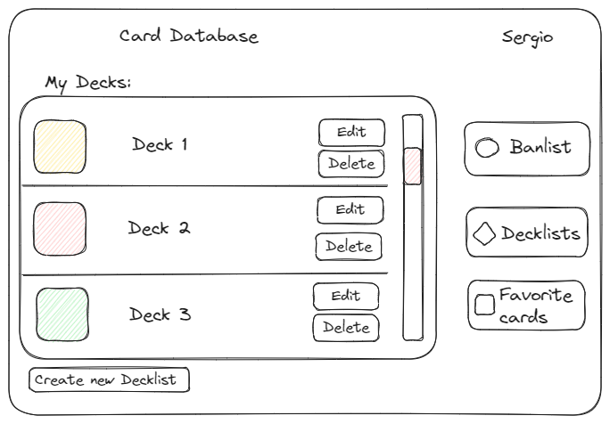
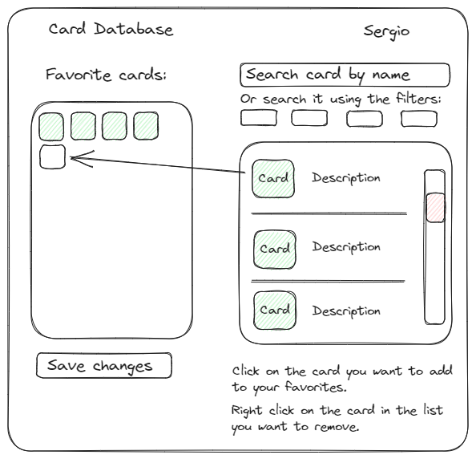
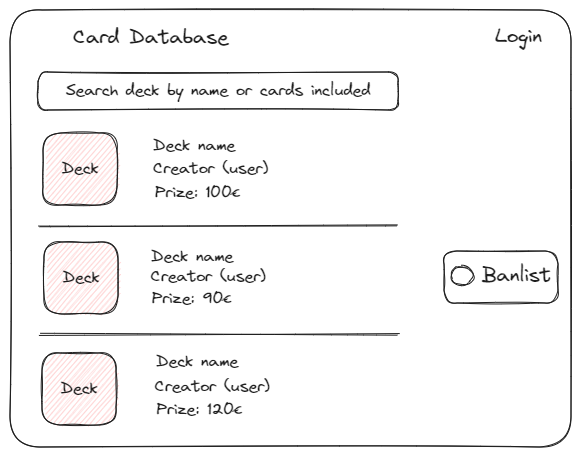
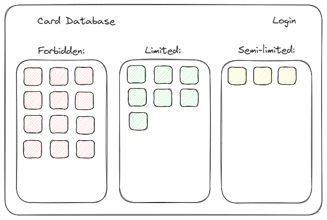

# YugiProject

Esta aplicación es una base de datos con las cartas del juego Yu-Gi-Oh!

El usuario podrá consultar las cartas existentes en el juego, crear y modificar sus propios mazos de cartas (deck) y ver los mazos creados por otros usuarios, así como consultar la lista de cartas prohibidas y limitadas en el juego actualmente (banlist). 

- Página principal => GET http://localhost:4000/

.png>)

El acceso a la página principal no estará protegido, pero el cliente solo tendrá acceso a la consulta de cartas, decks de los usuarios y banlist. Para poder crear y guardar sus propios decks deberá registrarse. Una vez lo haya hecho cambiará el diseño de la página principal:

.png>)

- Página personal del usuario => GET http://localhost:4000/:usuario (ruta protegida)

En esta página el usuario podrá consultar los decks ya creados por él, pudiendo editarlos o borrarlos, así como crear nuevos decks, y también tendrá acceso a su lista de cartas favoritas.

- Página de creación/edición de deck => GET http://localhost:4000/:usuario/decks (ruta protegida)

.png>)

El usuario tendrá acceso a esta página a través del botón "Create new decklist" en la pantalla de usuario o desde el botón "Edit" que hay al lado de los decks ya creados (en cuyo caso se le pasará el listado de cartas de ese deck a esta página).

La página tendrá el buscador de cartas en la parte derecha, y clicando en las mismas podrá añadirlas al deck. Podrá también quitar cartas del deck clicando en el botón derecho sobre aquellas que quiera quitar.

Una vez hechos todos los cambios, cuando el usuario pulse en el botón "Save changes" se lanzará la siguiente petición:

POST http://localhost:4000/:usuario/deck

Esta petición mandará objeto que contendrá el nombre del deck y un array con los nombres de las cartas, y el modelo se encargará de crear una tabla en el backend con el listado de cartas del mazo y nombrada como "usuario-deck".

- Página de favoritos => GET http://localhost:4000/:usuario/favorites (ruta protegida)

El usuario podrá añadir o quitar cartas de este listado de favoritas de la misma forma que con los decks.

- Decklists => GET http://localhost:4000/decklists

A esta página se podrá acceder desde el botón "Decklists". Contendrá todos los decks creados por los usuarios, y se podrá acceder sin estar logueado. Cuando clickemos en uno de los decks que aparecen, nos llevará a la página que veremos a continuación.

- Decks creados => GET http://localhost:4000/:usuario/:deck (el usuario no tiene por qué ser el cliente)

.png>)

Aquí podremos ver en detalle las cartas del deck en el que hemos clickado antes. La única diferencia entre acceder sin hacer login y estando logueado es que si entramos logueados podremos copiar el deck que estamos consultando con el botón "Copy decklists". Esta acción crea un nuevo deck con nuestro nombre de usuario y el nombre del deck, con la misma petición POST con la que creamos un deck desde cero o editamos un deck existente.

.png>)

- Banlist => GET http://localhost:4000/banlist

En Yu-Gi-Oh! se pueden utilizar un máximo de tres copias de la misma carta por mazo. En esta página podremos consultar la lista actualizada con las cartas prohibidas, limitadas (máximo 1 copia) y semilimitadas (máximo 2 copias).

